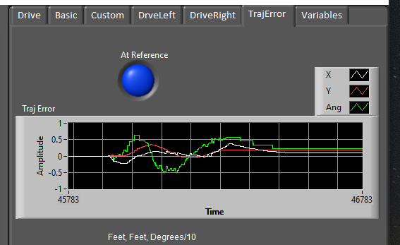
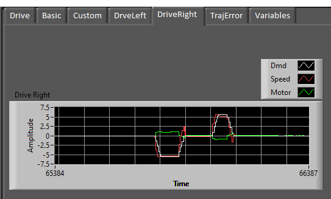
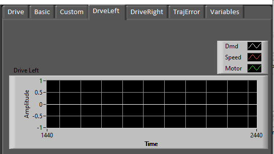
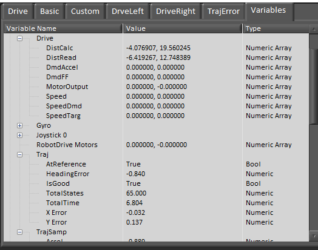
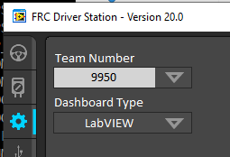

## FRC_LB_Trajectory_Dashboard Project

This is an enhancement of the standard LabVIEW dashboard project, containing a number of additional tabs showing trajectory and robot drive information.  This is intended to be used with the sample robot projects that demonstrate the FRC LabVIEW Trajectory Library.  This library is an UNOFFICIAL port of the Java/C++ 
WPILIB routines that don't already exist in LabVIEW.  Before using these projects, install the library.  Here is a link to the github repository for the library.  https://github.com/jsimpso81/FRC_LV_TrajLib

### Additional Dashboard Tabs

The sample robots publish a number of Network Table variables.  Any dashboard can view these.  

### Using the Dashboard

1. **Build** the dashboard.  
1. Copy the **FRC_Dashboard** directory the is created under **Builds** to **%HOMEDRIVE%%HOMEPATH%\Documents\LabVIEW Data\builds\**
1. Configure the Driver Station to use the **LabVIEW** Dashboard

---
File last updated: 8/4/2020

