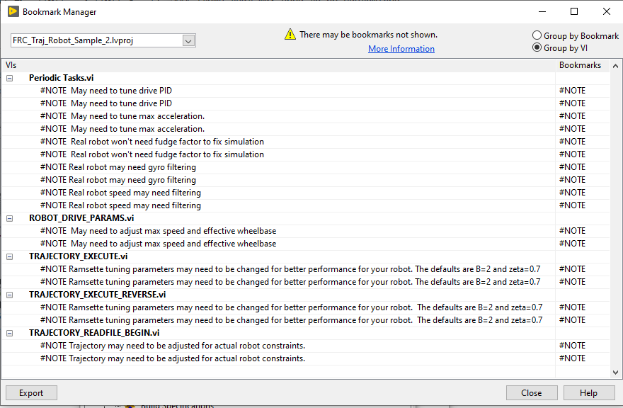
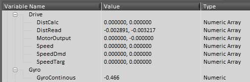

## FRC LabVIEW Trajectory Robot Sample 2 Project

This sample robot based on the standard LabVIEW robot project, contains both a simulated and physical robot that reads and executes a trajectory.  This sample robot demonstrate the FRC LabVIEW Trajectory Library.  This library is an UNOFFICIAL port of the Java/C++ 
WPILIB routines that don't already exist in LabVIEW.  Before using these projects, install the library.  Here is a link to the github repository for the library.  https://github.com/jsimpso81/FRC_LV_TrajLib

The simulated robot target code runs on a PC.  The physical robot target code, after modification to match the robot's hardware, can be run on an FRC robot.  

The robot code reads a trajectory file as part of the `BEGIN.VI` routine. This trajectory file was created using one of the utility programs.  The trajectory can then be executed in TELEOP by pressing the “A” button on an xbox style controller, or equivalent button on any controller.  The trajectory can be executed in reverse by pressing the "B" button.  The trajectory will stop executing as soon as the button is released.

This robot code does not have an autonomous routine to execute a trajectory, but you could easily add that.

To run the simulated robot:
1. Copy 'Sample-Robot-2-Trajectory-TrajLibrary.CSV` file to the `Documents\LabVIEW Data` directory before running the simulated robot.
1. Start the FRC Driverstation and optionally start the dashboard.
1. In the LabVIEW project under the "Computer" target, open "Robot Main.vi" and press the run arrow.
1. A simulated field should be displayed.  Communications with the driver station should be established.
1. Use the driver station to change the mode to "teleop enabled", then use the joystick to drive the robot.

To run on a physical robot:
1. Update BEGIN.VI and PERIODIC TASKS.VI, and others, as needed to match the hardware on your robot.
1. Build and deploy the trajectory file to the roboRIO using the `CopyTrajectoryDataFileToRobot` build specification

1. Build and deploy the robot code the same as would be done for any robot.
1. Drive the robot...

The Driver Station log shows the status of the trajectory file read.  "Prints" may need to be enabled to see these messages.

### Joystick control map

The teleop controls were assigned to an game (xbox) type controller.

- **Left Stick X** -- Turn robot left and right
- **Left Stick Y** -- Drive robot forward and backwards
- **A** -- Execute trajectory
- **B** -- Execute trajectory in reverse

### Items that may need to be customized

Bookmarks in the LabVIEW project describe some items that may need to be customed on the simulated and physical robots to maximize performance.  

The trajectory file may need to be rebuilt if contraints of the physical robot are different than the simulated robot.

### Using a Custom Trajectory

Use the utility programs to create your own trajectory.  If you don't want to modify the BEGIN.INI to read a different file, use the same file name for your trajectory.  Copy the new trajectory to the correct directory or the PC or the robot, then execute the robot program.  Any errors reading the directory will display on the Driver Station event log.

Note that the Linux operating system on the roboRIO uses case sensetive file name.

### Custom Dashboard

This repository contains a custom Dashboard project that contains additional tabs to help track trajectory progress.

### Network Table Variables

This sample robot publishes a number of Network Table variables that can be used to observe drive and trajectory progress and performance.

Drive System variables

Trajectory variables

### Custom Code

All the code customizations are compartmentalized into separate routines that are then called by the standard 
routines in the **Team Code** project directory.

These are the trajectory related custom subVI

These are utility custom subVI

---
File last updated: 8/4/2020
