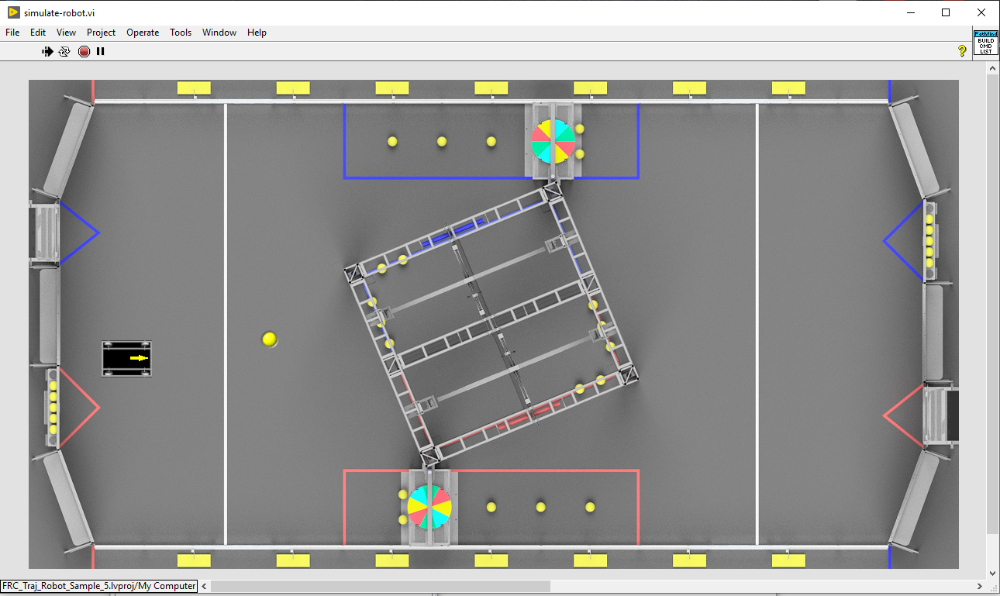

# FRC_Traj_Robot_Sample_5 Labview Project

This is a modified sample swerve drive test robot program for using the 
FRC LabVIEW trajectory Library.

This sample reads a trajectory from a file, similar to sample 2

This robot can be run on a windows PC using the LabVIEW simulation.

Run the trajectory by pressing the "A" button (on an xbox 360 controller), or it's
equivalent on another controller when in teleop enabled mode.  

There are network table variables that can be watched during execution to view the
current trajectory error and the drive system variables.  

There are 3 custom subVI for the Trajectory.
	TRAJECTORY_CREATE_PAATHFINDER_BEGIN
	TRAJECTORY_EXECUTE
	TRAJECTORY_FGV

Hopefully they are documented enough to figure out what they do and how they work.

NOTE: The Trajectory library is an implementation of the FRC java/c++ trajectory/ramsete 
code from the FRC java / c++ WPILIB.  

NOTE: Consider the trajectory library implementation to be beta code.  It hasn't been fully tested.
It has never been tested on a real robot.  If you find errors or make fixes, please let me know.

## FRC_Traj_Robot_Sample_5 Project

This LabVIEW robot project is a simple swerve drive robot.  (No swerve drive is really simple...)

[Project specific readme file](http:FRC_Traj_Robot_Sample_5/readme.md)

### Running in Simulation

This robot runs somewhat differently in simulation.  Instead of executing `Robot Main.VI`, execute `simulate-robot.vi`.  
This will display an overhead simulation screen.  The other simulation screen will appear, but it should be ignored.

### Joystick control map:

The teleop controls were assigned to an game (xbox) type controller.

- **Left Stick Y** -- Drive robot forward and backwards
- **Right Stick X** -- Drive robot left and right (robot orientation stays the same)
- **Right Trigger** -- Spin robot orientation clockwise
- **Left Trigger** -- Spin robot orientation counter-clockwise
- **A** -- Execute trajectory (robot orientation stays the same)
- **B** -- Execute trajectory (robot orientation points in direction of travel)
- **X** -- Execute trajectory in reverse (robot orientation stays the same)
- **Y** -- Execute trajectory in reverse (robot orientation points in direction of travel)

When not executing a trajectory, combinations of the other controls can be used to drive the robot.  
For example, **Left Stick Y** and **Right Trigger** pressed at the same time will cause the robot to travel in a circle. 

3/27/2020 J.Simpson

