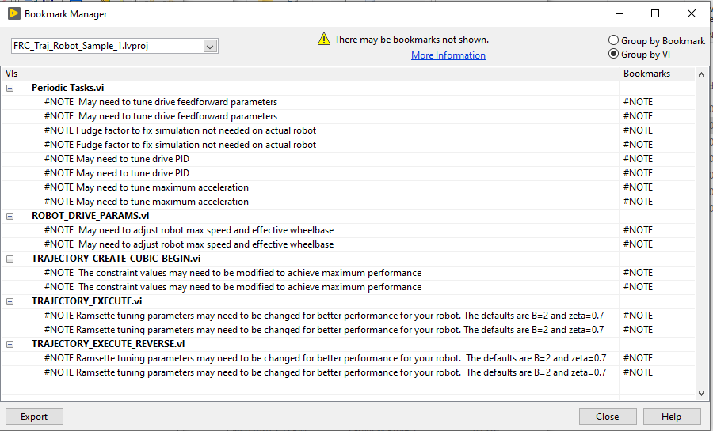
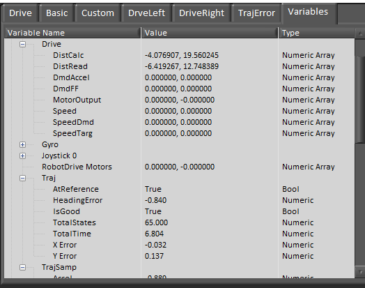

# FRC LabVIEW Trajectory Library Utilities and Samples

This repository contains several LabVIEW projects containing utilities,
library sample and test programs, several sample robots, and a sample
robot dashboard.

## FRC_Traj_Util Project

This LabVIEW project contains the source and build specifications for the 4 utilties
installed with the FRC LabVIEW Trajectory Library.  These utilities create trajectory files
and convert trajectory files from one type to another.  They can be used regardless 
of the programming language used on the robot.  The utilities are:

- **Create Trajectory Using Trajectory Library**

	Create a trajectory using the trajectory library routines and write it to a CSV (comma separated value) file that can be
	copied to a RoboRIO and read by the robot code.  The trajectory is created by:

	a. Defining robot properties
	b. Defining drive system constraints
	c. Defining the trajectory "waypoints".
	d. Creating and reviewing the trajectory.  If changes need to be made to back to steps 1,2,3 as needed.
	e. Write the trajectory to a file.

	Sample screen shot
	

	Sample trajectory file
	

- **Create_Trajectory_Using_PathfinderDifferential**

	Create a trajectory using Jaci Brunning's Pathfinder library for a robot using a "differential drive" and write it to a 
	CSV (comma separated value) file that can be
	copied to a RoboRIO and read by the robot code.

	More information on Pathfinder can be found here https://github.com/JaciBrunning/Pathfinder  
	One of the biggest differences between this Trajectory Library and Pathfinder is that Pathfinder uses S curves instead of
	trapezoids.

	Sample trajectory file
	

- **Create_Trajectory_Using_PathfinderSwerve**

	Create a trajectory using Jaci Brunning's Pathfinder library for a robot using a "swerve drive" and write it to a 
	CSV (comma separated value) file that can be
	copied to a RoboRIO and read by the robot code.    

	More information on Pathfinder can be found here https://github.com/JaciBrunning/Pathfinder  
	One of the biggest differences between this Trajectory Library and Pathfinder is that Pathfinder uses S curves instead of
	trapezoids.

- **Convert PathWeaver JSON File To Trajectory File**

	Read a JSON file created by the PathWeaver utility.  Write this trajectory as a CSV file for use with this library.

## FRC_Traj_Samples Project

This LabVIEW project contains a number of test programs and samples using the Trajectory Library.  Many of the test programs are VERY rudimentrary.  This project is a continuing work in progress. 

## FRC_Traj_Robot_Sample_1 Project

This LabVIEW project contains both a simulated and real robot. The robot code creates a trajectory using cubic splines as part of the BEGIN routine. The trajectory can then be executed in TELEOP by pressing the “A” button on an xbox style controller, or equivalent button on any controller.  The trajectory can be executed in reverse by pressing the "B" button.  A number of Network Table variables are written showing the status of an executing trajectory.

To run the simulated robot:
1. Start the FRC Driverstation and optionally start the dashboard.
2. In the LabVIEW project under the "Computer" target, open "Robot Main.vi" and press the run arrow.
3. A simulated field should be displayed.  Communications with the driver station should be established.
4. Use the driver station to change the mode to "teleop enabled", then use the joystick to drive the robot.

To run on a real robot:
1. Update BEGIN.VI and PERIODIC TASKS.VI as needed to match the hardware on your robot.
3. Build and deploy the robot code the same as would be done for any robot.
4. Drive the robot...

### Joystick control map

The teleop controls were assigned to an game (xbox) type controller.

- **Left Stick X** -- Turn robot left and right
- **Left Stick Y** -- Drive robot forward and backwards
- **A** -- Execute trajectory
- **B** -- Execute trajectory in reverse

### Items that may need to be customized

Here are some items that may need to be customed on the simulated and real robots to maximize performance.

## FRC_Traj_Robot_Sample_2 Project

This LabVIEW project contains both a simulated and real robot. The robot code reads a trajectory from a file as part of BEGIN.vi routine. The trajectory can then be executed in TELEOP by pressing the “A” button on an xbox style controller, or equivalent button on any controller.   A number of Network Table variables are written showing the status of an executing trajectory.  Also, the Driver Station log shows the status of the trajectory file read.  ("Prints" may need to be enabled to see these messages.)

To run  the simulated robot, the .CSV file needs to be copied to the “\Documents\LabVIEW Data” directory before running the simulated robot. Then follow the steps for "Robot Sample 1" to run the robot.

To run on a real robot. 
1. Use the special build specfication to build and deploy the trajectory file.
2. Follow the real robot steps for "Robot Sample 1".

The joystick controls are the same as Sample 1

Special build/deploy step to copy the trajectory CSV file.

### Items that may need to be customized

Here are some items that may need to be customed on the simulated and real robots to maximize performance.

Also, the trajectory file may need to be rebuilt to customize the constraints for a real robot.

## FRC_Traj_Robot_Sample_3 Project

This LabVIEW project is identical to" Robot Sample 1" except that it uses quintic splines instead of cubic splines. 

The joystick controls are the same as Sample 1
 
## FRC_Traj_Robot_Sample_4 Project

This LabVIEW project is identical to "Robot Sample 1" except that it uses Jaci's Pathfinder to create the trajectory.

The joystick controls are the same as Sample 1

Pathfinder is a shared library that needs to be copied to the RoboRIO.  There is a 

## FRC_Traj_Robot_Sample_5 Project

This LabVIEW robot project is a simple swerve drive robot.  

### Joystick control map:

The teleop controls were assigned to an game (xbox) type controller.

- **Left Stick X** -- Drive robot left and right (robot orientation stays the same)
- **Left Stick Y** -- Drive robot forward and backwards
- **Right Trigger** -- Spin robot orientation clockwise
- **Left Trigger** -- Spin robot orientation counter-clockwise
- **A** -- Execute trajectory
- **B** -- Execute trajectory in reverse

## FRC_LV_Trajectory_Dashboard Project

This LabVIEW dashboard project contains tabs showing trajectory progress diagnostic information.

The sample robots publish a number of Network Table variables.  Any dashboard can view these.  

